<p align="center">
  
</p>


# 🚀 Docker + Django: Containerize the Right Way with Nginx, Postgresql & Gunicorn. 
### Full production setup using Docker, EC2, RDS, Route 53, and Terraform.

This project demonstrates how to deploy a Django web application in production on AWS with:

✅ Containerize with Nginx, Postgresql & Gunicorn

✅ A Dockerized Django app on EC2

✅ A PostgreSQL database hosted on Amazon RDS

✅ Infrastructure managed with Terraform

✅ HTTPS secured with AWS ACM and a custom domain via Route 53

## 🔧 Start the project

Clone repo from Github:

```Ubuntu
git init
git clone https://github.com/mainocean/django_ec2_complete.git
```
Check status:

```Ubuntu
git status
git pull
```

Create  `.env` file:
```Ubuntu
python3 -m venv venv
source venv/bin/activate
```
Install all requirements:
```Ubuntu
pip install -r requirements.txt
```

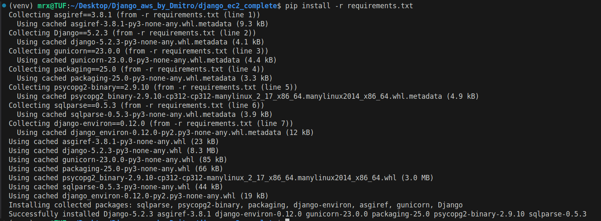


Collects all static files (CSS, JavaScript, images) from each app and places them in a single folder (usually staticfiles/):
```bash
python3 manage.py collectstatic
```

Mainly used in production, not development.

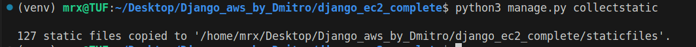

Ensures that all static content can be served efficiently.

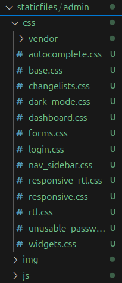

Useful when deploying, especially on services like Heroku or AWS.

This command generates new migration files based on the changes you’ve made to your models (models.py):

```bash
python3 manage.py makemigrations
```


These migration files track how your database schema should change.

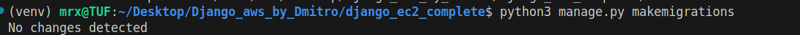

It doesn’t change the database yet — just prepares the instructions.

Think of it as: “I’ve changed the models; now generate the plan to update the DB.”

This command applies migrations to the database, i.e., actually creates or alters tables:
```bash
python3 manage.py migrate 
```
(you likely meant this one instead of repeating manage.py)

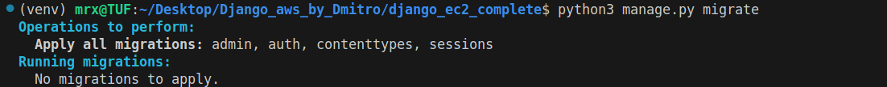

Runs SQL commands under the hood.

Keeps the database schema in sync with your models.

Creates an admin user for the Django admin panel:

It will prompt you for username, email, and password.

```bash
python3 manage.py createsuperuser
```
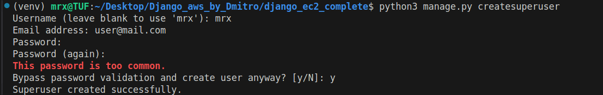

Starts the Django development server:
```bash
python3 manage.py runserver
```
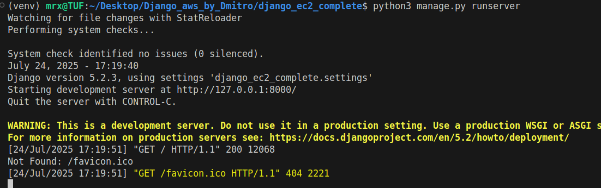

Once created, you can log into http://localhost:8000/admin.

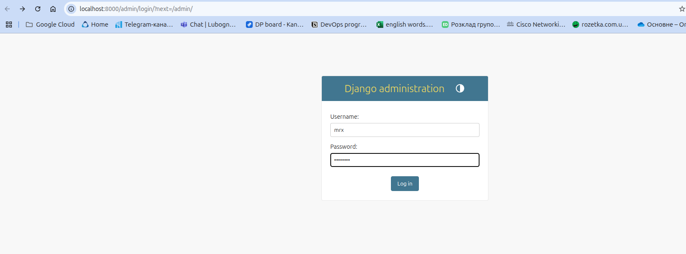

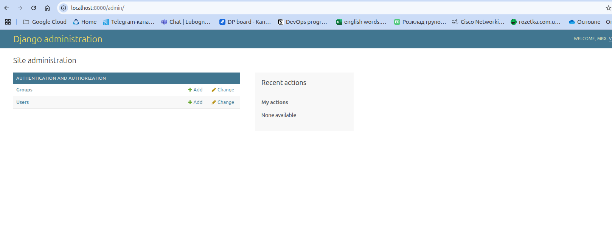Default: http://127.0.0.1:8000/


Use this during development to test your site locally.

### Create docker-compose.yml

What you’ve posted here is a **`docker-compose.yml` setup** for running Django + Nginx with Docker Compose.

It’s a good alternative to running `docker build …` manually — let me show you how to make it work properly.

---

### 📄 Correct `docker-compose.yml`

Here is a cleaned-up version of what you posted:

```yaml
services:
  db:
    image: postgres:17
    ports:
      - "5432:5432"
    volumes:
      - postgres_data:/var/lib/postgresql/data
    env_file:
      - .env.prod

  django-web:
    build:
      context: .
    env_file:
      - .env.prod
    ports:
      - "8080:8080"
    depends_on:
      - db
    volumes:
      - ./static:/app/staticfiles


  frontend-proxy:
    image: nginx:latest
    ports:
      - "8001:80"
    volumes:
      - ./nginx.conf:/etc/nginx/nginx.conf:ro
      - ./static:/static:ro
    depends_on:
      - django-web
volumes:
  postgres_data:

```

---

### 📄 nginx config (`nginx/default.conf`)

Put this file at: `nginx/default.conf`:

```
vents {}

http {
    server {
        listen 80;

        location / {
            proxy_pass http://django-web:8080;
            proxy_set_header Host $host;
            proxy_set_header X-Real-IP $remote_addr;
            proxy_set_header X-Forwarded-For $proxy_add_x_forwarded_for;
        }

        location /static/ {
            alias /static/;
        }
    }
}

```

---

### 📄 Django `.env`

In your `./django/` folder, create a `.env` file (or make sure it exists):

```bash
cd django
touch .env
```

Edit `.env` and put your environment variables:

```
DEBUG=True
SECRET_KEY=super-secret-key
DATABASE_URL=sqlite:///db.sqlite3
```

---


### Stop the service using port 5432
Run this to find the process using port 5432:

```bash
sudo lsof -i :5432
```

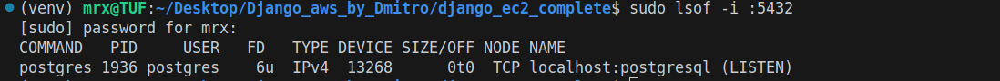


Then stop it:

```bash
sudo systemctl stop postgresql
```

Or if it's a Docker container:

```bash
docker ps
```
then stop it using:
```bash
docker stop <container_id>
```

Then 

### 🏗 Run it docker-compose

From the **root of your project (where `docker-compose.yml` lives):**

```bash
docker-compose up --build
```

You should see:

- Django app building and starting Gunicorn on port 8000 inside container
- Nginx container starting and listening on your host at port 8080
- You can open `http://localhost:8080/` in your browser.


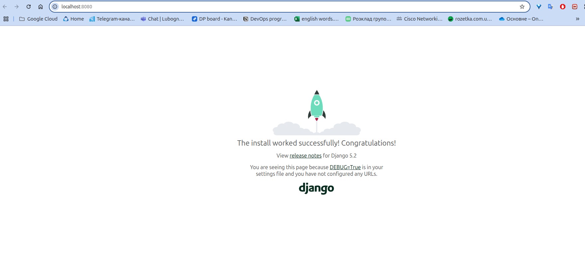
---

### 📝 Notes

✅ You don’t need to manually `docker build` anymore — `docker-compose` will build the Django image for you.

✅ The `context: ./django` assumes your Django `Dockerfile` and code are inside `./django/`.

So check your folder structure. It should look like:

```
project-root/
├── docker-compose.yml
├── nginx/
│   └── default.conf
├── django/
│   ├── Dockerfile
│   ├── .env
│   ├── manage.py
│   ├── myapp/
│   └── requirements.txt

```

If your `Dockerfile` is not yet in `django/`, move it there or change the `build.context` in `docker-compose.yml`.


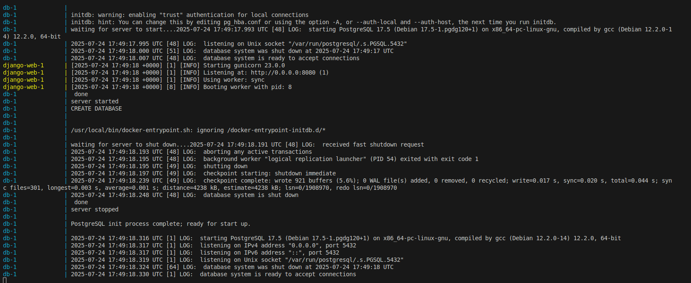

http://localhost/

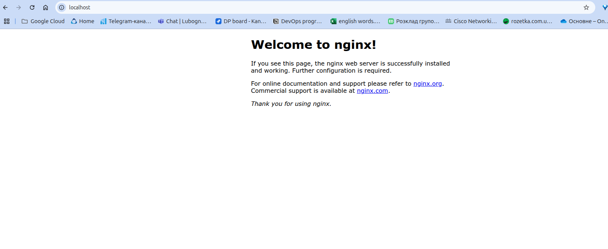

### 📚 Documentation
Full documentation is available here:  
👉 [Project Docs on GitHub](https://github.com/mainocean/DevOps_tutorials/tree/main/lessons/004/docs)

This includes:

- Infrastructure setup with Terraform
- Django project deployment
- AWS EC2 integration
- Docker configuration
- Troubleshooting and tips
### 📚 Resources
- Blog Betterstack
  
  📖 Tutorial reference:
```
https://github.com/betterstack-community/docker-django-demo
https://www.youtube.com/watch?v=1v3lqIITRJA&ab_channel=BetterStack
```
- Official Django Docs
- AWS CLI Setup
- Terraform AWS Provider
- Gunicorn Docs: https://docs.gunicorn.org/
- Nginx Configuration: https://nginx.org/en/docs/
- Python-dotenv: https://pypi.org/project/python-dotenv/

### 🛠️ Tech Stack

- 🐍 **Django 4+** (Python 3.12)  
- 🐘 **PostgreSQL 16** (Amazon RDS)  
- 🐳 **Docker** & **Gunicorn**  
- ☁️ **AWS** (EC2, RDS, VPC, IAM, ACM, Route 53)  
- 🧱 **Terraform** (for IaC)


### 📦 Project Structure

```
django_ec2_complete/                  # Root of the project

├── .github/                          # GitHub workflows/config (CI/CD)
├── .terraform/                       # Terraform working directory (auto-created, not usually in repo)
├── aws/                              # (likely) AWS-specific configs/scripts

├── bash/                             # Bash scripts for automation
│   ├── build.sh                      # Build the project/container
│   ├── create_main_tf.sh             # Script to generate Terraform main config
│   ├── database.sh                   # Database-related automation
│   ├── push_to_ecr.sh                # Push Docker image to AWS ECR
│   └── start_pj.sh                   # Script to start the Django project

├── django_ec2_complete/              # Django project source code
│   ├── __pycache__/                  # Python bytecode cache (auto-generated)
│   ├── __init__.py                   # Marks this as a Python package
│   ├── asgi.py                       # ASGI config for async servers
│   ├── settings.py                   # Django settings (DB, installed apps, etc.)
│   ├── urls.py                       # URL routes
│   └── wsgi.py                       # WSGI config for production servers

├── docs/                             # (likely) project documentation

├── venv/                             # Python virtual environment
│   ├── bin/                          # Executables and scripts
│   ├── lib/                          # Installed Python packages
│   ├── lib64/                        # Symlink or additional libs
│   └── pyvenv.cfg                    # Virtualenv config

├── .gitignore                        # Files/folders to ignore in git
├── .terraform.lock.hcl               # Terraform provider lock file
├── db.sqlite3                        # Django SQLite database

# Infrastructure as Code (Terraform):
├── database.tf                       # Terraform DB resources
├── domain.tf                         # Terraform Route53 domain config
├── ec2.tf                            # Terraform EC2 instance config
├── network.tf                        # Terraform VPC, subnets, routing, etc.
├── outputs.tf                        # Terraform outputs
├── providers.tf                      # Terraform provider settings
├── security_group.tf                 # Terraform security groups
├── ssh.tf                            # Terraform SSH keypair, etc.
├── terraform.tfstate                 # Terraform state file (tracks infra state)
├── terraform.tfstate.backup          # Backup of state file
├── variable.tf                       # Terraform input variables

├── Dockerfile                        # Build Docker image for Django app
├── manage.py                         # Django CLI management tool
├── README.md                         # Project description & usage
├── requirements.txt                  # Python dependencies

```

###  🚀 To deploy

 ```bash
 terraform init
 terraform apply
 ```

### 🧹 Cleanup
To destroy resources:

```
terraform destroy
```

### 🛡️ License
MIT License — Use this freely and modify for your projects.
